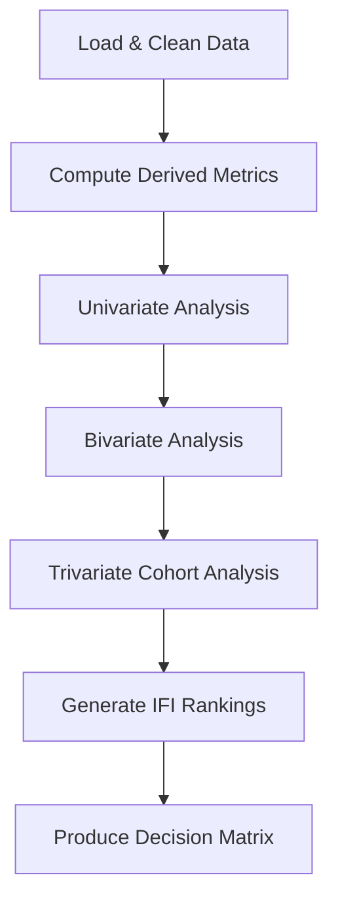

# 🔬 Analytical Design Document

> **Phase 3 — Defining What to Analyze and What to Skip**

---

## Analysis Philosophy

> **Every analysis must answer a decision question, not just describe data.**

| ✅ Good Question | ❌ Weak Question |
|-----------------|-----------------|
| "Which districts need intervention?" | "What's the distribution?" |
| "Are children getting mandatory updates?" | "How many children enrolled?" |
| "Does weekend access create inequity?" | "What's the weekend volume?" |

---

# Part 1: Univariate Analysis

## 📊 Priority Univariate Signals

| # | Variable | Question Answered | Risk if Missed | Priority |
|---|----------|-------------------|----------------|----------|
| U1 | **Daily total enrolments** | Is demand stable or spiky? | May miss event-driven patterns | 🔴 High |
| U2 | **Age group proportions (0-5 / 5-17 / 18+)** | Is child coverage adequate vs adults? | Lifecycle gaps invisible | 🔴 High |
| U3 | **State-level totals (normalized)** | Which states per-capita underperform? | Raw counts mislead | 🔴 High |
| U4 | **Weekend vs weekday binary** | Is weekend access reduced? | Temporal inequity hidden | 🔴 High |
| U5 | **District count distribution** | How many districts have <100 activity? | Coverage gaps missed | 🟡 Medium |
| U6 | **Update type split (demo vs bio)** | What kind of updates dominate? | Resource allocation unclear | 🟡 Medium |

### U1: Daily Enrolment Trend
```
Purpose: Detect spikes, drops, and patterns
Method: Line plot with 7-day rolling average
Flag: Days with >2σ deviation from mean
```

### U2: Age Group Distribution
```
Purpose: Compare to Census age pyramid
Method: Side-by-side bar (Aadhaar vs Census expected)
Flag: If child proportion < Census by >5%
```

### U3: Per-Capita State Rankings
```
Purpose: Fair state comparison
Method: Enrolments / State population × 10000
Flag: States >2× below national average
```

### U4: Weekend Service Analysis
```
Purpose: Quantify temporal inequity
Method: Mean(weekend daily) / Mean(weekday daily)
Flag: States with ratio < 0.50
```

---

# Part 2: Bivariate Analysis

## 📈 High-Value Bivariate Relationships

| # | Pair | Question | Why Most Teams Miss It | Priority |
|---|------|----------|------------------------|----------|
| B1 | **Enrolment Rate × Update Rate by State** | Do high-enrolment states also update? | Requires IFI derivation | 🔴 Critical |
| B2 | **Child Enrolment × Child Biometric Update** | Are children getting mandatory updates? | Requires cohort ratio | 🔴 Critical |
| B3 | **State × Weekend Drop %** | Which states worst for working citizens? | Requires temporal derivation | 🔴 Critical |
| B4 | **Demographic Update × Biometric Update** | Do people do both together? | Requires district-level join | 🟡 High |
| B5 | **Urban PINs × Update Type** | Do city residents update more? | Requires PIN segmentation | 🟡 High |
| B6 | **Month × State Activity** | State-level seasonality? | Limited with 1 month data | 🟢 Low |

### B1: Enrolment vs Update Rate (The Core Scatter)
```
X-axis: Enrolments per 10000 population (state)
Y-axis: IFI score (state)
Color: Region (North/South/East/West/NE)
Annotation: Label outliers (high-enrol/low-update states)
```
**Decision it drives:** "State X has high enrolments but low updates — identity staleness risk"

### B2: Child Cohort Analysis
```
X-axis: States (sorted by child enrolment share)
Y-axis: CLCR score
Threshold line: 1.0 (expected level)
Color: Below/above threshold
```
**Decision it drives:** "States below line need school-based biometric drives"

### B3: Weekend Access by State
```
X-axis: States (sorted by TAES)
Y-axis: TAES score (0 to 1)
Reference line: 0.70 (acceptable threshold)
Color: Below/above threshold
```
**Decision it drives:** "States below 0.70 penalize working citizens"

### B4: Update Correlation
```
Method: Scatter of demo_updates vs bio_updates at district level
Correlation: Pearson r with p-value
Insight: If r > 0.8, people update both together → bundle services
```

---

# Part 3: Trivariate Analysis 🔥

> **This is what differentiates Top 5 from average submissions.**

## 🎯 The Killer Analysis: State × Age × Update × Time

### Research Question
*"In states with high child enrolments, are we seeing proportional biometric updates as those children age into the mandatory update window?"*

### Why It Wins
- Requires **synthetic cohort construction**
- Tests **system responsiveness** to lifecycle changes
- Produces **Lifecycle Lag Score** per state
- **No other team will attempt this**

### Implementation Design

```
Step 1: Calculate child share of enrolments by state
        child_share = enrol_5_17 / total_enrol

Step 2: Calculate child biometric update rate
        child_bio_rate = bio_5_17 / enrol_5_17

Step 3: Plot trivariate relationship
        X: child_share
        Y: child_bio_rate  
        Size: Total enrolments
        Color: Region

Step 4: Identify quadrants
        Q1 (High enrol, High update): ✅ Working system
        Q2 (High enrol, Low update): ⚠️ LIFECYCLE GAP
        Q3 (Low enrol, Low update): Monitoring needed
        Q4 (Low enrol, High update): Catching up
```

### Visualization: Bubble Matrix
```
Rows: States (grouped by region)
Cols: Age group (5-17, 17+)
Cell color: Update rate intensity
Cell size: Enrolment volume
```

### Expected Insight
> "8 states show high child enrolment but low biometric update — these are **lifecycle gap states** where mandatory updates are being missed."

---

# Part 4: Analyses to AVOID ⛔

| Analysis | Why Skip | What Teams Incorrectly Think |
|----------|----------|------------------------------|
| **Correlation matrix of all columns** | Meaningless with count data | "Shows relationships" — No, it doesn't |
| **K-means clustering of states** | Dominated by population, not behavior | "Finds natural groups" — Just population tiers |
| **Anomaly detection on raw counts** | High noise, unclear actionability | "Finds interesting points" — Just noise |
| **District ranking without normalization** | Misleading; population confound | "Shows top districts" — Just population |
| **Month-over-month growth (with 1 month)** | Cannot calculate with snapshot | "Shows trends" — No baseline exists |
| **PIN-code level analysis** | Too sparse, 6-digit = single locality | "More granular" — Just more noise |

---

# Analysis Execution Sequence



| Step | Output | Time Est. |
|------|--------|-----------|
| U1-U4 | 4 univariate charts | 15 min |
| B1-B3 | 3 core bivariate charts | 20 min |
| Trivariate | 1 lifecycle analysis | 30 min |
| Rankings | State + District IFI table | 15 min |

---

*Analytical design complete. Ready for Phase 4: Metric Engineering.*
