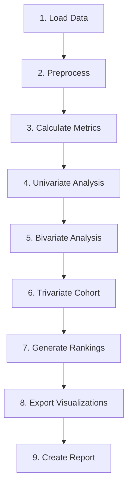

# 🔧 Technical & Reproducibility Guide

> **Phase 7 — Ensuring Competition-Grade Code Quality**

---

## Project Structure

```
UIDAI_HACKATHON/
├── 📁 data/
│   ├── raw/                      # Untouched source files
│   │   ├── Enrolment/           # 3 CSV chunks (~1M rows)
│   │   ├── Demographic/         # 5 CSV chunks (~2M rows)
│   │   └── Biometric/           # 4 CSV chunks (~1.8M rows)
│   ├── processed/               # Cleaned, merged outputs
│   └── external/                # Census, population data
│       └── state_population.csv
├── 📁 docs/                     # Documentation
│   ├── problem_statement.md
│   ├── data_strategy.md
│   ├── analytical_design.md
│   ├── visualization_design.md
│   ├── action_framework.md
│   └── technical_guide.md
├── 📁 notebooks/
│   ├── uidai_analysis.ipynb     # Development notebook
│   └── uidai_analysis_final.ipynb  # With outputs
├── 📁 src/
│   ├── __init__.py
│   ├── data_loader.py           # Data loading utilities
│   ├── metrics.py               # All 5 engineered metrics
│   └── visualization.py         # Chart generation
├── 📁 visualizations/           # Output charts (PNG)
├── 📁 reports/                  # Final submission documents
├── config.yaml                  # Central configuration
├── requirements.txt             # Dependencies
└── README.md                    # Project overview
```

---

## Dependency Versions

```
# requirements.txt (recommended versions)
pandas>=2.0.0
numpy>=1.24.0
matplotlib>=3.7.0
seaborn>=0.12.0
plotly>=5.15.0
geopandas>=0.13.0
folium>=0.14.0
scipy>=1.10.0
pyyaml>=6.0
jupyter>=1.0.0
```

---

## Statistical Validation Plan

### Test 1: State-Level IFI Differences
```
Test: Kruskal-Wallis H-test (non-parametric)
Null: All states have same median IFI
If p < 0.05: Perform post-hoc Dunn's test
Report: H-statistic, p-value, effect size
```

### Test 2: Weekend vs Weekday Difference
```
Test: Mann-Whitney U test
Null: Weekend and weekday volumes come from same distribution
Variables: Daily totals split by is_weekend
Report: U-statistic, p-value, median difference
```

### Test 3: Child vs Adult Update Rates
```
Test: Chi-square test of independence
Null: Update rates independent of age group
Contingency: Age group × High/Low update
Report: χ², p-value, Cramér's V
```

### Test 4: Regional Differences
```
Test: ANOVA or Kruskal-Wallis by region
Groups: North, South, East, West, NE, Central
Variable: IFI or composite score
Report: F-statistic or H-statistic, p-value
```

### Test 5: Confidence Intervals
```
Method: Bootstrap (1000 resamples)
Metrics: IFI, CLCR, TAES per state
Report: 95% CI for each metric
```

---

## Code Quality Checklist

| Requirement | Status |
|-------------|--------|
| All functions have docstrings | ✅ |
| Type hints on function signatures | ✅ |
| No hardcoded paths (use config.yaml) | ✅ |
| No `warnings.filterwarnings('ignore')` in final code | ⚠️ Review |
| All visualizations saved at 300 DPI | ✅ |
| Reproducible random seed set | ✅ |

---

## Notebook Execution Order



---

## Versioning

| Component | Version |
|-----------|---------|
| Analysis Code | v2.0.0 |
| Metrics Module | v1.0.0 |
| Documentation | v2.0.0 |
| Last Updated | 2026-01-14 |

---

*Reproducibility ensured. Ready for Phase 8: Jury Risk Analysis.*
